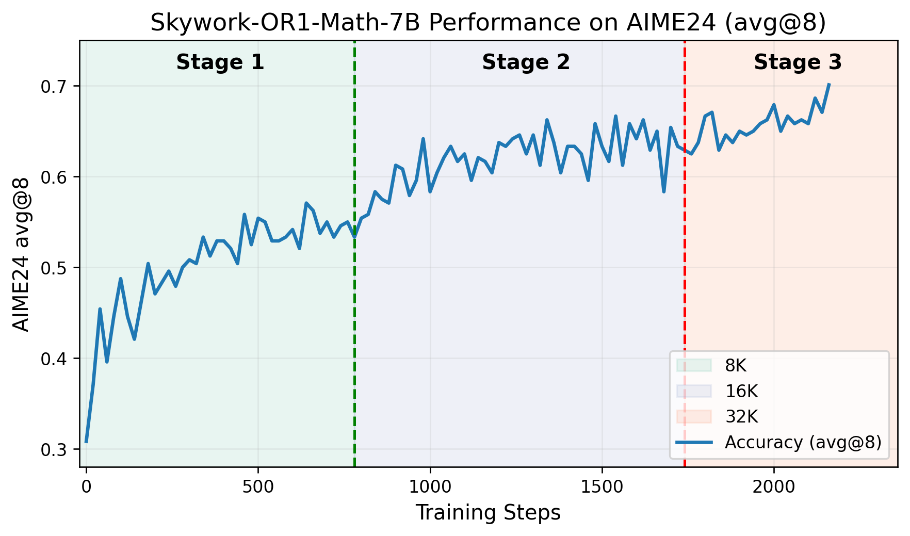
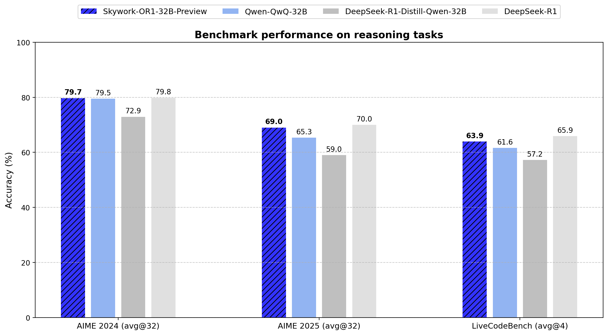
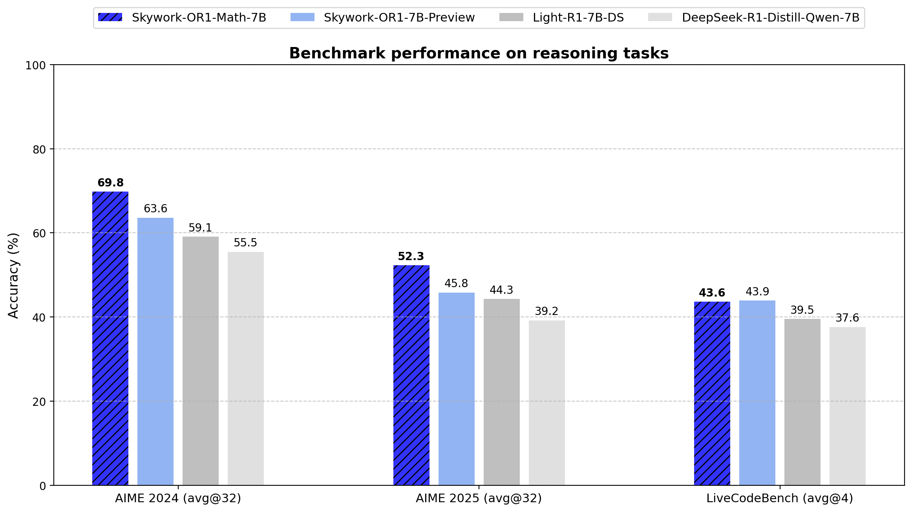

<div align="center">

# 🤔 Skywork-OR1 (Open Reasoner 1)

<div>
✊ Unleashing the Power of Reinforcement Learning for Math and Code Reasoners 🤖
</div>

</div>
<div>
<br>

<div align="center">

[](https://huggingface.co/collections/Skywork/skywork-or1-67fa1bcb41b436ef2def76b9)
[](https://huggingface.co/datasets/Skywork/Skywork-OR1-RL-Data)
[](https://github.com/SkyworkAI/Skywork-OR1)
[](https://capricious-hydrogen-41c.notion.site/Skywork-Open-Reaonser-Series-1d0bc9ae823a80459b46c149e4f51680)

[](https://github.com/SkyworkAI/Skywork-OR1/stargazers)
[](https://github.com/SkyworkAI/Skywork-OR1/fork)

</div>

## 🔥 News

- **April 13, 2025**: We release the **`Skywork-OR1`** (Open Reasoner 1) series of models, including **`Skywork-OR1-Math-7B`**, **`Skywork-OR1-32B-Preview`**, and **`Skywork-OR1-7B-Preview`**. We open-source
  - 🤗 Model weights: [`Skywork-OR1-Math-7B`](https://huggingface.co/Skywork/Skywork-OR1-Math-7B),  [`Skywork-OR1-32B-Preview`](https://huggingface.co/Skywork/Skywork-OR1-32B-Preview), [`Skywork-OR1-7B-Preview`](https://huggingface.co/Skywork/Skywork-OR1-7B-Preview)
  - 🤗 Training data: [`Skywork-OR1-RL-Data`](https://huggingface.co/datasets/Skywork/Skywork-OR1-RL-Data) (Coming Soon)
  - 🧑‍💻 Code: [`Skywork-OR1`](https://github.com/SkyworkAI/Skywork-OR1)
  - We also release a [Notion Blog](https://capricious-hydrogen-41c.notion.site/Skywork-Open-Reaonser-Series-1d0bc9ae823a80459b46c149e4f51680) to share detailed training recipes and extensive experimental results, analysis, and insights, dedicated to helping the community to better research, understand, and push the frontier of open reasoning models.

## 📖 Overview

<div align="center">


<sub>The AIME24 scores versus training steps of Skywork-OR1-Math-7B in our multi-stage training pipeline.</sub>
</div>

The **`Skywork-OR1`** (Open Reasoner 1) model series consists of powerful math and code reasoning models trained using large-scale rule-based reinforcement learning with carefully designed datasets and training recipes. This series includes two general-purpose reasoning models—**`Skywork-OR1-7B-Preview`** and **`Skywork-OR1-32B-Preview`**—along with a math-specialized model, **`Skywork-OR1-Math-7B`**.

- **[`Skywork-OR1-Math-7B`](https://huggingface.co/Skywork/Skywork-OR1-Math-7B)** is specifically optimized for mathematical reasoning, scoring **69.8** on AIME24 and **52.3** on AIME25 — well ahead of all models of similar size.
- **[`Skywork-OR1-32B-Preview`](https://huggingface.co/Skywork/Skywork-OR1-32B-Preview)** delivers the 671B-parameter Deepseek-R1 performance on math tasks (AIME24 and AIME25) and coding tasks (LiveCodeBench).
- **[`Skywork-OR1-7B-Preview`](https://huggingface.co/Skywork/Skywork-OR1-7B-Preview)** outperforms all similarly sized models in both math and coding scenarios.

The final release version will be available in two weeks.

## 📊 Evaluation

<div align="center">
<div style="display: flex; justify-content: center; gap: 20px;">


</div>
</div>
<br>

We evaluate our models on AIME24, AIME25, and LiveCodeBench. Instead of using Pass@1, which is common in prior work, we introduce Avg@K as the primary metric. This metric robustly measures a model's average performance across K independent attempts, reducing the impact of randomness and enhancing the reliability of the results. We believe that Avg@K provides a better reflection of a model's stability and reasoning consistency.

We include the detailed results in the following table.

| Model | AIME24 (Avg@32) | AIME25 (Avg@32) | LiveCodeBench (8/1/24-2/1/25) (Avg@4) |
|-------|---------|---------|--------------|
| DeepSeek-R1-Distill-Qwen-7B | 55.5 | 39.2| 37.6 |
| Light-R1-7B-DS | 59.1 | 44.3| 39.5 |
| DeepSeek-R1-Distill-Qwen-32B | 72.9 | 59.0| 57.2 |
| TinyR1-32B-Preview | 78.1| 65.3| 61.6 |
| QwQ-32B | 79.5 | 65.3| 61.6 |
| DeepSeek-R1 | 79.8 | 70.0| 65.9 |
| **Skywork-OR1-Math-7B** | 69.8 | 52.3 | 43.6 |
| **Skywork-OR1-7B-Preview** | 63.6 | 45.8 | 43.9 |
| **Skywork-OR1-32B-Preview** | 79.7 | 69.0 | 63.9 |

## 🎯 Getting Started

### Installation

Docker environment:

```bash
docker pull whatcanyousee/verl:vemlp-th2.4.0-cu124-vllm0.6.3-ray2.10-te2.0-megatron0.11.0-v0.0.6

# Launch the desired Docker image:
docker run --runtime=nvidia -it --rm --shm-size="10g" --cap-add=SYS_ADMIN -v <image:tag>

# Inside the container, install Skywork-OR1
git clone https://github.com/SkyworkAI/Skywork-OR1.git && cd Skywork-OR1 && pip3 install -e .
```

Conda environment:

```bash
# Installing Python 3.10 Environment.
conda create -n verl python==3.10
conda activate verl

# Installing RLLM dependencies.
pip3 install torch==2.4.0 --index-url https://download.pytorch.org/whl/cu124
pip3 install flash-attn --no-build-isolation
git clone https://github.com/SkyworkAI/Skywork-OR1.git
cd Skywork-OR1
pip3 install -e .
```

### Training ⚙️

Training scripts are currently being organized and will be available in 1-2 days. Please stay tuned.


### Evaluation ⚖️

We provide evaluation scripts to reproduce the results of the `Skywork-OR1-Series`.

#### Data Preparation

Evaluation data for AIME24 and AIME25 is already available in our GitHub repository.

For Livecodebench, please download the data from [Hugging Face](https://huggingface.co/datasets/Skywork/LiveCodeBench).

```bash
# Download LiveCodeBench
huggingface-cli download Skywork/LiveCodeBench --repo-type=dataset --local-dir ./or1_data/eval/livecodebench
unzip ./or1_data/eval/livecodebench/livecodebench.zip -d ./or1_data/eval/livecodebench/
mv ./or1_data/eval/livecodebench/livecodebench/* ./or1_data/eval/livecodebench/
```

#### Evaluation Start
```bash
bash ./or1_scripts/eval/eval_7b.sh

bash ./or1_scripts/eval/eval_32b.sh
```

The evaluation results will be automatically saved to [outputs/evalation/pass.csv](outputs/evalation/pass.csv)


## 📄 Technical Report

Our technical report will be released soon. Stay tuned!

## 🙏 Acknowledgements

- Both of our models are trained on top of [`DeepSeek-R1-Distill-Qwen-7B`](https://huggingface.co/deepseek-ai/DeepSeek-R1-Distill-Qwen-7B) and [`DeepSeek-R1-Distill-Qwen-32B`](https://huggingface.co/deepseek-ai/DeepSeek-R1-Distill-Qwen-32B).
- Both models are trained using [a custom fork](https://github.com/SkyworkAI/Skywork-OR1) of the wonderful [`verl`](https://github.com/volcengine/verl) project.

## 📚 Citation

We will update the citation once the technical report is released. In the meantime, please cite the following:

```bibtex
@misc{skywork-or1-2025,
  title={Skywork Open Reaonser Series},
  author = {He, Jujie and Liu, Jiacai and Liu, Chris Yuhao and Yan, Rui and Wang, Chaojie and Cheng, Peng and Zhang, Xiaoyu and Zhang, Fuxiang and Xu, Jiacheng and Shen, Wei and Li, Siyuan and Zeng, Liang and Wei, Tianwen and Cheng, Cheng and An, Bo and Liu, Yang and Zhou, Yahui},
  howpublished={\url{https://capricious-hydrogen-41c.notion.site/Skywork-Open-Reaonser-Series-1d0bc9ae823a80459b46c149e4f51680}},
  note={Notion Blog},
  year={2025}
}
```
